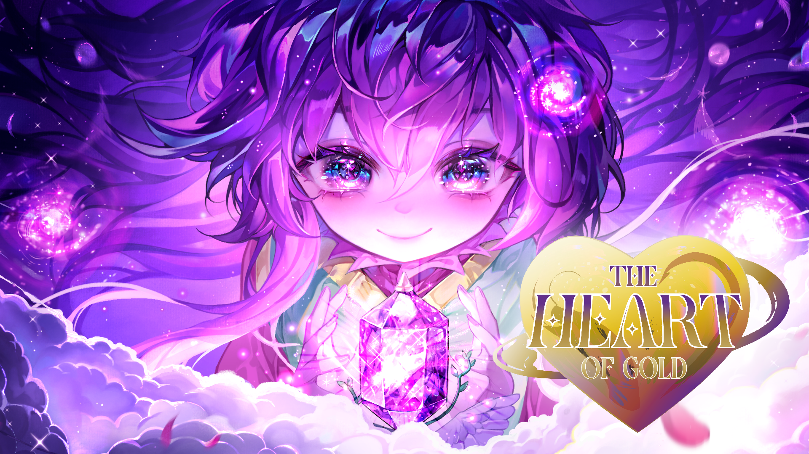

---

OFFICIAL SITE REPOSITORY
THE HEART OF GOLD 

The Heart of Gold is a Bullet Heaven game with RPG mechanics that offer a deep and highly replayable experience. Each character has their own combat style thanks to a unique stat scaling system, two active skills, one passive skill, and one ultimate skill, allowing you to develop varied strategies in each game.

---

GAME FEATURES

Strategic Party System
Build your dream team from 18 unique characters, each with distinct combat styles and voice acting available in Spanish, English, and Japanese. Recruit heroes for RPG-style dungeon exploration and team them up in specialized squads to gather rare materials and experience.

Intense Bullet Heaven Combat
Face thousands of creatures in dynamically generated maps with day/night cycles. Master a deep combat system featuring unique stat scaling, two active skills, and powerful Ultimate abilities. Survive waves of enemies before time runs out.

Engaging Gameplay Mechanics
Experience a blend of strategy and action. Plan your party composition, manage your characters' growth, and adapt your tactics to face increasingly difficult challenges.

---

TECHNICAL STACK

Frontend Framework: Vanilla JavaScript
Graphics & Rendering: WebGL with custom shader system
Animation: GSAP (GreenSock Animation Platform)
Asset Pipeline: Custom preloading system supporting fonts, images, and dynamic shaders
Effects: Advanced post-processing with bloom effects, directional blur, and dynamic backgrounds
Architecture: Modular ES6 class-based structure

---

BROWSER COMPATIBILITY

This website features advanced WebGL effects and modern JavaScript (ES6+). For the best experience, use a modern browser with WebGL support:

Desktop: Chrome, Firefox, Safari, Edge (latest versions)
Mobile: Full support on iOS Safari and Android Chrome

---

COPYRIGHT NOTICE

Copyright 2026 The Heart Of Gold Team. All rights reserved.

This repository contains the official site for The Heart Of Gold. The game design, characters, artwork, sound effects, and all related content are the exclusive property of The Heart Of Gold Team.

Official Website: The Heart Of Gold
Developer: The Heart Of Gold Team

For inquiries or licensing, please contact the official Heart Of Gold Team by their social media.

---

ABOUT THIS REPOSITORY

This is the official web presence for The Heart Of Gold game. It serves as the primary hub for game information, features showcase, and community engagement. The website features advanced WebGL graphics, dynamic animations, and an immersive user interface designed to bring the game's world to life.
